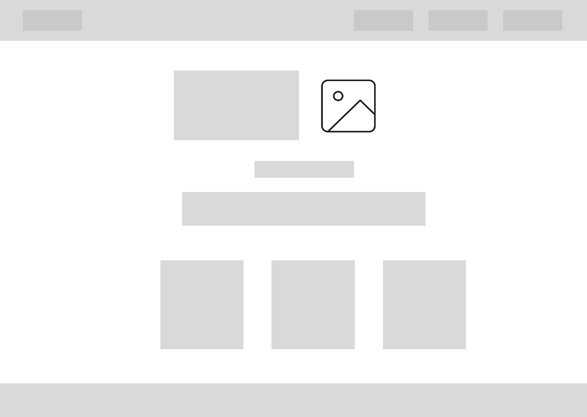

# **Learning Hub – Landing Page**

A clean and responsive landing page built using **HTML** and **CSS**, developed during my internship at **Cyberdude Networks**.
This project focuses on simple layout design, beginner-friendly structure, and clean UI for learning web development resources in **Tamil**.

---

## 🌐 **Live Demo**

🔗 **Live Link:** _Add your deployed link here_

---

## 🖼️ **Wireframe**

Below is the wireframe used during the design phase:

---

## ✨ **Features**

- Responsive navigation bar
- Clean hero section with title & description
- About section with aligned content
- Course cards section
- Simple hover animations
- Contact form
- Footer with social links

---

## 🛠️ **Technologies Used**

- **HTML5**
- **CSS3 (Flexbox)**

---

## 👨‍💻 **Author**

**Santhosh**
Developed during Cyberdude Networks Internship
